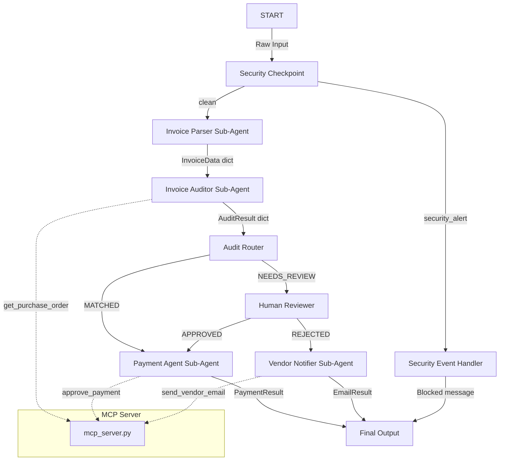

# Submission Write-Up — Invoicer Agent

## Problem Statement
In corporate procurement and finance, matching supplier invoices against internal purchase orders (PO) is a high-volume, error-prone manual process. Organizations face significant operational bottlenecks and financial risks:
* **Overpayments**: Paying invoices that exceed PO limits or charge for unreceived goods.
* **Fraud**: Vulnerabilities to invoice phishing, billing scams, or instruction spoofing.
* **Manual Delay**: Finance teams waste hours cross-referencing lines, chasing approvals, and emailing vendors about pricing/quantity discrepancies.

The **Invoicer Agent** automates this matching workflow, flags discrepancies immediately, handles security scrubbing/vulnerability checking, requests human sign-off when high risk, and performs automatic ledger/email follow-ups.

## Solution Architecture

## Concepts Used

This project leverages key capabilities of the Google GenAI Agent Development Kit (ADK) and the Model Context Protocol (MCP):
1. **ADK 2.0 Workflows**: Implemented in [app/agent.py](file:///z:/Vibe%20Coding/AI%20Agents/adk-workspace/invoicer-agent/app/agent.py) using the graph-based API. Node routing and state sharing handle structured decision pipelines.
2. **LlmAgent**: Used for specialized sub-agents: `invoice_parser`, `invoice_auditor`, `payment_agent`, and `vendor_notifier`.
3. **MCP Server**: Designed in [app/mcp_server.py](file:///z:/Vibe%20Coding/AI%20Agents/adk-workspace/invoicer-agent/app/mcp_server.py) using the FastMCP SDK, serving as the interface to the enterprise PO database, payment ledger, and email simulation.
4. **Security Checkpoint**: Implemented as the first node `security_checkpoint` in `app/agent.py` to intercept injection, scrub PII, and generate structured audit logs.
5. **Agents CLI**: Scaffolding and local orchestration handled via the `agents-cli` tool.

## Security Design

The agent integrates a security gate at input:
* **Prompt Injection Defense**: Intercepts keywords like "ignore previous instructions" or "override role" to redirect attacks safely to a security handler node, preventing the model from leaking backend system details.
* **PII Redaction**: Regular expression filters automatically scrub SSNs and Credit Card numbers from incoming invoices, preventing sensitive personal information from reaching LLM logs.
* **Audit Logging**: Every security evaluation, audit outcome, and human decision writes a structured JSON log to `sys.stderr` containing timestamps and severity metrics (`INFO`, `WARNING`, `CRITICAL`), ensuring a complete, audit-compliant record.

## MCP Server Design

The Model Context Protocol (MCP) server in `app/mcp_server.py` exposes 4 specialized tools:
1. `get_purchase_order(po_number)`: Retrieves the verified PO details from a secure mock database.
2. `approve_payment(invoice_number, po_number, amount)`: Registers approved payments into the transaction ledger and returns a unique Transaction ID.
3. `flag_discrepancy(invoice_number, po_number, details)`: Logs unresolved matching errors to flag them in ERP systems.
4. `send_vendor_email(vendor_name, subject, body)`: Simulates sending email notifications directly to suppliers.

## Human-in-the-Loop (HITL) Flow

To prevent financial loss, human intervention is embedded at high-risk inflection points:
* **Discrepancy Resolution**: If the invoice amount or items do not match the PO, the agent yields a `RequestInput` block to request manual review.
* **High-Value Threshold**: Invoices exceeding $5,000.00 require human review, enforcing a corporate policy check.
* The workflow halts execution state, allowing managers to inspect discrepancies in the playground UI and reply with `APPROVED` or `REJECTED`.

## Demo Walkthrough

The project includes three pre-configured test scenarios:
1. **Perfect Match (Happy Path)**: The invoice INV-9901 matches PO-1001 for $5,000.00, resulting in automatic matching, payment approval, and ledger entry.
2. **Mismatch (Discrepancy Path)**: Invoice INV-9902 charges $1,800.00 for chairs, but PO-1002 only authorizes $1,500.00. The agent halts, requesting human decision.
3. **Attack Prevention (Security Path)**: System prompt override attempt is intercepted and blocked instantly.

## Impact & Value Statement
By automating the match-to-payment cycle, the **Invoicer Agent**:
* **Reduces processing costs** by over 80% through zero-touch automated processing.
* **Mitigates financial loss** by enforcing discrepancy checks and strict payment thresholds.
* **Assures compliance** via robust prompt inspection and structured audit logs.
* **Improves vendor relations** by expediting payment runs and automating polite dispute communications.
